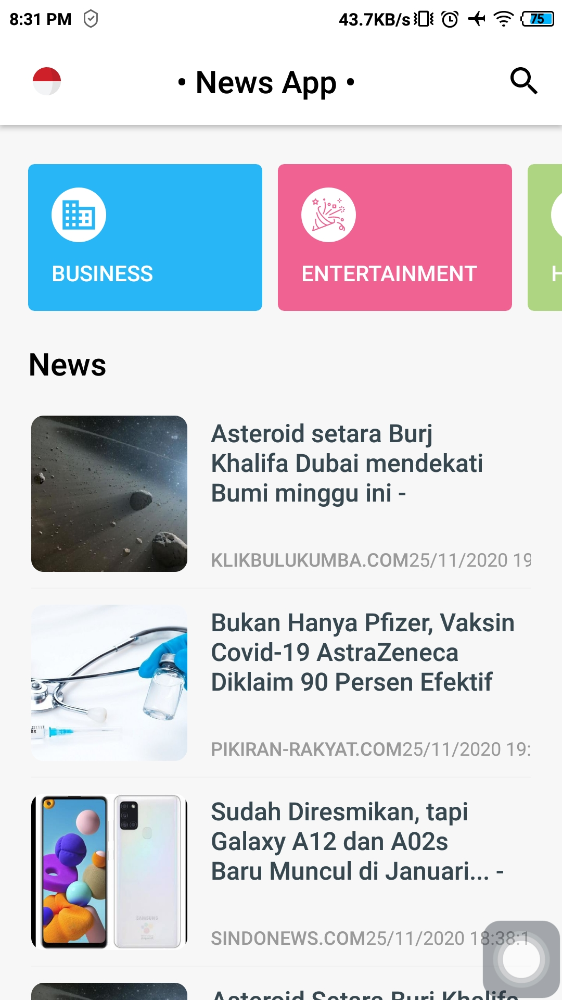
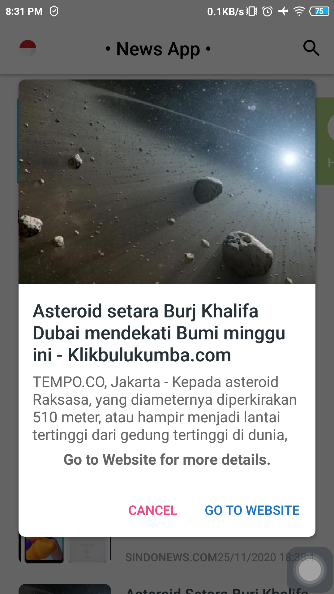
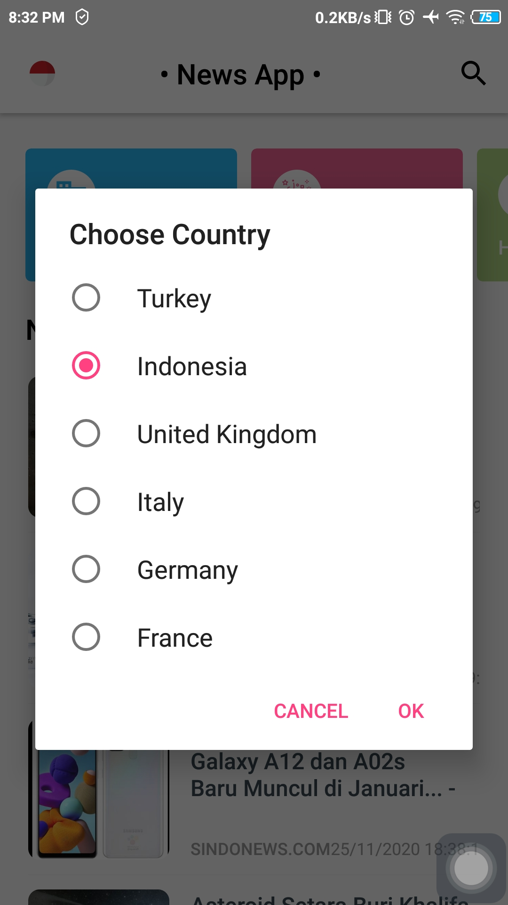

# NewsApp

[](https://www.android.com)
[](https://www.apache.org/licenses/LICENSE-2.0.html)
[](https://docs.gradle.org/current/release-notes)
[](https://java-lang.github.io/awesome-java)

📰 A Sample News App written in Java using Android Architecture Components, MVVM, etc.

# Instruction

## Gradle
```
buildscript {
    repositories {
        //add this mavenCentral()
        mavenCentral()
    }
    dependencies {
        //add this classpath to use butterknife
        classpath 'com.jakewharton:butterknife-gradle-plugin:10.2.1'
    }
}


dependencies {
    //Extended library
    //Data Binding
    implementation 'android.arch.lifecycle:extensions:1.1.1'

    //Gson
    implementation 'com.google.code.gson:gson:2.8.6'

    //ButterKnife
    implementation 'com.jakewharton:butterknife:10.2.3'
    annotationProcessor 'com.jakewharton:butterknife-compiler:10.2.1'

    //Glide
    implementation 'com.github.bumptech.glide:glide:4.11.0'
    annotationProcessor 'com.github.bumptech.glide:compiler:4.11.0'
    implementation 'com.github.bumptech.glide:annotations:4.11.0'
    implementation "com.github.bumptech.glide:okhttp3-integration:4.11.0"

    //Retrofit
    implementation 'com.squareup.retrofit2:retrofit:2.5.0'
    implementation 'com.squareup.retrofit2:converter-gson:2.5.0'
    implementation 'com.squareup.okhttp:okhttp:2.7.2'
}

apply plugin: 'com.jakewharton.butterknife'
```

## Notes

### Add News Api
---
You need to create a [News API](https://newsapi.org/) key and add it to the strings.xml file

### Features
---
- 5 different language resources.
- 6 different news categories.
- News search.
- News detail.
- Open the news source URL.

### Application Architecture
---
- IDE: Android Studio
- API: News API
- Arthitecture: MVVM
- Programming Language: Java
- Third Party Libraries: Retrofit, Glide, ButterKnife, Gson

# Demo App

<p align="center">
  <a href="https://github.com/achmadqomarudin/NewsApp/releases/latest/download/app-demo.apk">
    
  </a>
</p>

<table style="width:100%">
  <tr>
    <th>Example 1</th>
    <th>Example 2</th>
  </tr>
  <tr>
    <td></td>
    <td></td>
  </tr>
  <tr>
    <th>Example 3</th>
    <th>Example 4</th>
  </tr>
  <tr>
    <td></td>
    <td></td>
  </tr>
</table>

# License

```
    Copyright (C) Achmad Qomarudin

    Licensed under the Apache License, Version 2.0 (the "License");
    you may not use this file except in compliance with the License.
    You may obtain a copy of the License at

       http://www.apache.org/licenses/LICENSE-2.0

    Unless required by applicable law or agreed to in writing, software
    distributed under the License is distributed on an "AS IS" BASIS,
    WITHOUT WARRANTIES OR CONDITIONS OF ANY KIND, either express or implied.
    See the License for the specific language governing permissions and
    limitations under the License.
```
